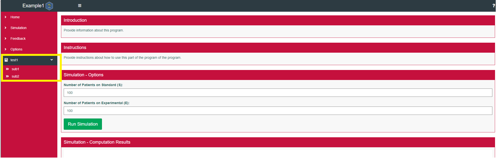

```{r, include = FALSE}
knitr::opts_chunk$set(
  collapse = TRUE,
  comment = "#>"
)
```

# Packages fRom tEmPlates (PREP) - Intro

## Motivation and Background 

In the recent years, R Shiny apps have gained considerable momentum and have been utilized to develop many useful dashboards and user interfaces (UI) allowing non-programmers access to innovative tools.   Due to the ease of development of Shiny apps and lack of large scale examples, R developers often create a new shiny app in a single app.r file that contains both the ui and server elements.   For very small applications, a single file may be sufficient.   However, as a project grows, and capabilities expand in the app, a common practice is to separate the code into two files, one for the server object and one for the ui object.    This approach can lead a developer or team of developers down a path to an application with many lines of code, eg 15,000+, in a single file that can be extremely difficult to debug, test, maintain or expand.   This approach can also lead to a file with a mixture of UI/server related code in the same files as complex computational code.  

The PREP package makes it easy to create modular shiny applications and R packages. The key functions are:

- `PREP::CreateApp()` creates modular Shiny applications.
- `PREP::CreatePackage()` creates analytic R packages with no Shiny app included.
- `PREP::AddModules()` and `PREP::AddTab()` add Shiny modules to existing apps created with PREP.
- `PREP::AddFunctionToPkg()` adds a new function with default headers and test file for testing the function.

## Overview

PREP expands upon [many](https://r-pkgs.org/) [useful](https://usethis.r-lib.org/) [resources](https://thinkr-open.github.io/golem/) to allow users to create shells for R Packages and Shiny applications with minimal configuration.  PREP is designed to be both accessible to new users and highly customizable by expert users. 

PREP provides 2 simple workflows to make new projects.

### Workflow 1 - Function Calls
1. Call `CreatePackage()`, `CreateApp()`  or `CreatePackage()` to create an R project with all of the needed pieces in a new directory. 
2. Open the new project and customize your app using your normal development workflow.

### Workflow 2 - Using R Studio
1. Click File-> New Project -> New Directory 
2. Choose PREP Package (similar to CreatePackage()), PREP Shiny as a Package (similar to CreateApp() ) or PREP Shiny App (similar to CreateAppStandalone())
3.  Enter the requested input.
 
That's it! This vignette introduces the package by creating a series of shiny applications saved in R packages, starting with very simple examples before proceeding to more complex workflows. 

## Set up

Before running the examples below install and load PREP as follows:

```
remotes::install_github("BioPharmSoftGrp/PREP")
library(PREP)
```

Unless noted, the examples below create new apps in your working directory, so call `setwd()` if desired before running these examples. Finally, while it's not required, we highly recommend using PREP in RStudio since it makes switching between .Rproj files very easy. 
 
## Examples

The rest of the vignette is a 'cookbook' showing how to create a series of sample apps. We'll add new examples as additional functionality is added in future releases.

### Example 1 - Create and Run a Shiny App in a Package

To create an app saved as an R package, call: 

```
CreateApp(strName="Example1")
usethis::proj_activate("Example1") #Activate the project for your new app
```

This creates a new folder called "Example1" in your working directory that contains your app and then opens it in a new RStudio session.  Note that calling `proj_activate` to open the project is the same as opening it using the "File->Open Project" menu option in RStudio. 

To run the app call the following in the new session: 

```
devtools::install() #install the app
Example1::RunApp()
```

That's it! You've got a working, modular shiny app that looks like this:


 
As shown, the default app is built with several tabs, each of which is implemented as its own Shiny Module. All code for these modules (and for the app itself) is saved in the `/R` folder. The default app is populated with examples of typical UI/Server interactions, and includes a few features that may be useful in most apps, like a the theme switcher in the options subtab. The code will need to be customized based on the intended use for the new application. The main goal of this simple default application is to provide a working framework that makes it easy for beginner and intermediate shiny users to get started building modular shiny code. 

### Example 2 - Create and run a standalone shiny app

We generally recommend creating apps within packages, but creating a standalone app is very similar. 

```
CreateApp(strName="Example2", strType="standalone")
```

Then browse to `/Example2/ShinyApp.R` and click "Run App" in the RStudio header to open the app. The app looks identical to the one shown above, but the code now lives in the `inst/` folder. Note that the following examples all use the package-based app, but similar logic applies when working with a standalone app - you'll generally want to add `strType="standalone` as an additional parameter when calling the helper functions discussed below. 

### Example 3 - Add a tab to your app

PREP makes it easy to customize the tabs in your app. First, create a new app: 

```
CreateApp(strName="Example3", vModuleIDs=c("Home")) #vModuleIDs lets you select which of the pre-loaded modules should be included in your app
usethis::proj_activate("Example3")
```

And call the `AddModule()` function in the new session:

```
PREP::AddModule("Simulation") #adding in the predefined simulation module
PREP::AddModule("CustomModule") #adding a new "custom" module

devtools::document() #update documentation
devtools::install() #install app with new module
Example3::RunApp()
```

The resulting app, has tabs for "Home", "Simulation" and "CustomModule". Note that special characters and spaces are also supported in module names, so something like `PREP::AddModule("On3 M0r3 M0du!e")` also works just fine.

### Example 4 - Custom Module with Subtabs

The `AddTab()` function is similar to `AddModules()`, but it also allows the creation of modules with subtabs. 

First, create an app with `CreateApp()` and in the new session:

```
PREP::AddTab("test1",vSubtabIDs=c("sub1","sub2"))
devtools::document()
devtools::install()
Example4::RunApp()  # Make sure the new package name is Example4, eg CreateApp(strName="Example4")
```



### Example 5 - Custom Module Template

You might've noticed that all of our modules look the same so far. That is expected since, PREP uses the same template for all modules by default. PREP does support custom module templates via the {whisker} package. First, create an app with `CreateApp()` (as shown above), then in the new session:

```
#Add new module using a custom templates
customUI <- "{{MODULE_ID}}UI <- function(){
        return(span('this is a HIGHLY CUSTOMIZED placeholder for {{MODULE_ID}} module'))
        }"
PREP::AddModules(
    vModuleIDs=c("CustomTemplateNewModule"),
    strUITemplate=customUI
)
devtools::document() #update documentation
devtools::install() #install app with new module
Example5::RunApp()
```

### Example 6 - Custom Module Template Loaded from a File

Using a string to define a template isn't very flexible or reusable, but a similar process can be used to load a template from a file. The example below, demonstrates how this works by loading a template saved in the PREP package, but you can just as easily load a template you've created and saved locally. 

First, create an app with `CreateApp()` and in the new session:
```

PREPPath <- paste0(.libPaths[1],"/PREP") # or update with the path to your PREP install
customUI <- paste(readLines(paste0(PREPPath,"/inst/library/app/mod_DemoTemplateUI.R")),collapse="\n")
customServer <- paste(readLines(paste0(PREPPath,"/inst/library/app/mod_DemoTemplateServer.R")),collapse="\n")
PREP::AddModules(
    vModuleIDs=c("CustomTemplateNewModuleFromFile"),
    strUITemplate=customUI,
    strServerTemplate=customServer
)
devtools::document()
devtools::install()
Example6::RunApp()

```

### Example 7 - AddFunctionToPkg

This function is useful when developing a calculation package.   

```
AddFunctionToPkg( "CalculatePValue", "This function computes the p-value of the desired test" )
```

As a result of the call above, a file named CalculatePValue.R is created in the R directory and file named test-CalculatePValue.R is created in the tests/testthat directory.  This call uses default templates with the function exported from the package and creates an empty test such that running the package tests will skip the test.   For more control and ability to change the default templates see the help for this function.  
